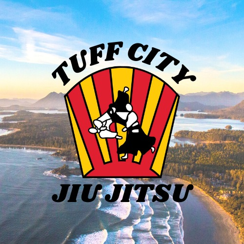

# README

    

        <h1>Tuff City Jiu Jitsu Club Website Project: Rails API</h1>
    

    

# Project Description: Renewed Development

Here is my React on Rails project to serve as a website for the Tofino "Tuff City" Jiu Jitsu Club. This website is intended to be a good resource for jiu-jitsu clubs around the world who are interested in developing support material for their training. This codebase is the Rails API side of it, with a Postgres database. Please also check out the [React client](https://github.com/TartanSpartan/Tuff-City-Jiu-Jitsu-Page-Client) on GitHub, which is the frontend of the application.

There are [previous versions of the website](https://github.com/TartanSpartan/Tuff-City-Jiu-Jitsu-Webpage/tree/development), based on older gemsets, but development has been resumed in these new repositores with new gems and a more focused approach. Many of the controllers, models etc still have relevant logic and have been ported over. Eventually I will also be looking to upgrade the node dependencies in the React project to a modern framework. Meanwhile the frontend aesthetics and overall functionality continues to be augmented regularly.

# Key folders and files

* Dependencies are defined in the [Gemfile](Gemfile) and [Gemfile.lock](Gemfile.lock) files

* Standard API-only controllers (mostly under the api/v1/ namespace), models, serializers etc

* Each of the aformentioned components is covered for testing by Rspec, with factories to generate sample data where appropriate, in the spec/ directory

* A gradually expanding set of database migrations to define new tables and relations, and the seed file to instantiate the database, are all listed in the db/ directory

* The [config/routes.rb](config/routes.rb) file defines the various routes, with the aid of the Devise framework at points

* [config/database.yml](config/database.yml) sets up the link to the Postgres database, with test, development and production versions set up using a combination of environment variables and encrypted files

* Please ensure that the Rails server is running and accessible on your network configuration alongside the React one

* Refer to the [React Client](https://github.com/TartanSpartan/Tuff-City-Jiu-Jitsu-Page-Client) ReadMe for more information

# Further information

For more information, please see the internal links below:

- [Getting Started](Documentation/GettingStarted.md)
- [Motivation and Planned Features](Documentation/MotivationAndPlannedFeatures.md)
- There are some novel features, such as:
- [API Oauth implementation for Google](app/controllers/api/v1/users/omniauth_callbacks_controller.rb) [and traditional form-based sign-in](app/controllers/api/v1/users_controller.rb) [and sign-up](app/controllers/api/v1/sessions_controller.rb)
- [Enforcement of CSRF protection which is particularly important for a fullstack implementation spread across several development machines](app/controllers/api/v1/csrf_tokens_controller.rb)